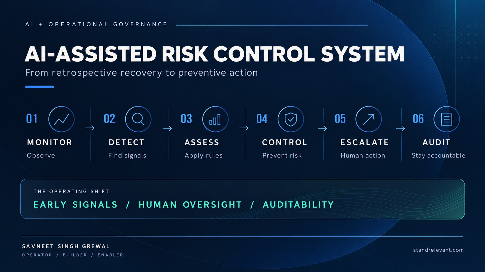
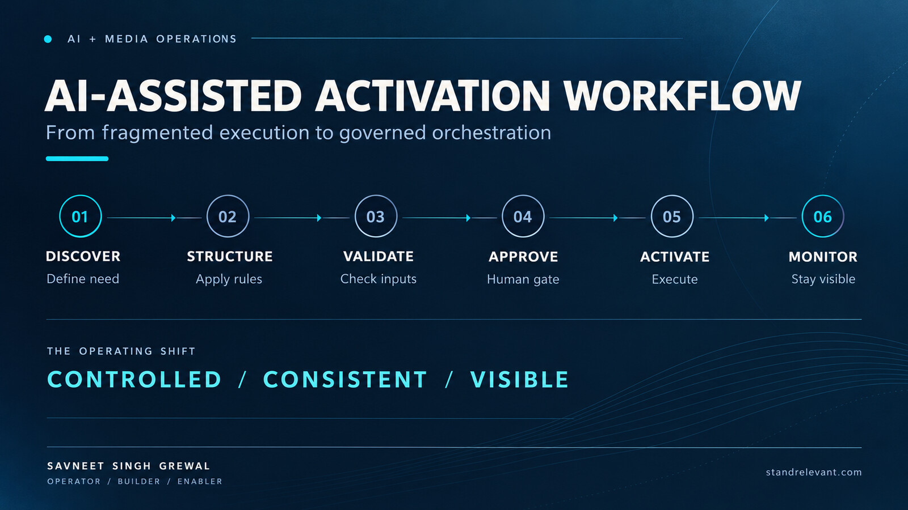

# Enterprise AI Operator Portfolio

### Savneet Singh Grewal

**Enterprise AI Operator · AI-Assisted Product Builder · Deployment & Adoption Leader**

[LinkedIn](https://www.linkedin.com/in/savneet-singh-grewal/) · [Stand Relevant](https://standrelevant.com) · [Email](mailto:aisavvy90@gmail.com)

---

## I turn operating problems into deployed AI workflows

I lead at the intersection of **media operations, enterprise AI, solution design and adoption**. My work starts with a measurable business constraint—not a technology demo—and continues through design, AI-assisted building, testing, governance, deployment and user enablement.

Alongside leading a **₹1,000 crore annual media business**, an **85-person organisation** and work spanning **100+ brands**, I build practical systems that improve control, execution and decision-making.

| Operating scale | AI delivery | Adoption |
|---|---|---|
| ₹1,000 crore annual media business | From business rules to production workflows | Enabled hundreds of practitioners |
| 85-person organisation | Human-in-the-loop controls | Training, rollout and iteration |
| 100+ brands | Cloud deployment and API integration | Business outcomes over demo theatre |

> **My focus: making AI useful, governable and adopted in real operations.**

---

## Selected work

### 01 · [AI-Assisted Risk Control System](case-studies/risk-control-system.md)

A governed preventive-control workflow that detects emerging operational risk, applies explicit rules, escalates exceptions and preserves an audit trail.

**Public outcome:** zero reported overspend incidents across the controlled scope after deployment.

### 02 · [AI-Assisted Activation Workflow](case-studies/activation-workflow.md)

A structured activation workflow replacing fragmented, repetitive execution with validation, approval controls, execution visibility and operational monitoring.

**Public outcome:** 75% lower execution effort, with zero reported execution errors or delays during the monitored rollout.

### 03 · [SpokenNext — Voice-to-Action AI](case-studies/spokennext.md)

A deployed voice-to-action prototype that converts an unstructured thought into reviewable tasks and calendar-ready actions.

**Design principle:** use AI to interpret; use deterministic logic and human confirmation to execute.

[Try the live prototype](https://ai-brain-dump-794462594625.asia-south1.run.app/?final-android=1)

---

## How I move from problem to production

1. **Discover** the costly constraint in the operating model.
2. **Design** the business rules, controls, workflow and success measures.
3. **Build** through AI-assisted development and platform integrations.
4. **Test** normal paths, edge cases, ambiguity and failure modes.
5. **Deploy** with permissions, logging, rollback and human oversight.
6. **Adopt** through training, rollout support and feedback loops.
7. **Measure** business outcomes, not feature output.

Read the full framework: [From Business Problem to Production AI](frameworks/from-problem-to-production-ai.md).

---

## Where AI fits—and where it does not

I use probabilistic models for interpretation, classification, structuring and candidate actions. High-consequence execution remains bounded by deterministic controls, explicit permissions, validation and human review.

That separation matters in enterprise environments: the system must be useful when the model is uncertain, an API fails or the user changes their mind.

Read more: [Responsible Deployment and Adoption](frameworks/responsible-deployment-and-adoption.md).

---

## AI and technical fluency

**AI:** LLM workflows · structured outputs · prompt design · human-in-the-loop AI · agentic workflow concepts · evaluation and failure-mode thinking

**Build and deployment:** Python · Next.js · APIs · Google Apps Script · OAuth · Google Calendar API · GitHub · Google Cloud Run · testing and debugging

**Enterprise delivery:** use-case discovery · business-case design · solution shaping · operating governance · deployment planning · adoption · executive stakeholder engagement

---

## My role in the build

I am not positioning myself as a traditional software engineer. I am an operator and AI-assisted product builder who owns the journey from business problem to working system: requirements, business logic, workflow architecture, AI-assisted development, testing, deployment, enablement and iteration.

The production repositories behind enterprise work remain private. This portfolio deliberately excludes client identities, proprietary code, internal configurations and commercially sensitive operating data. See [Disclosure and Confidentiality](DISCLOSURE.md).

---

## AI enablement

Beyond building systems, I design practical learning and adoption experiences that help teams move from AI curiosity to confident application. These programmes have enabled **hundreds of practitioners** through live demonstrations, applied use cases and operating guidance.

[Read the enablement case study](case-studies/ai-enablement.md)

---

## Contact

**Savneet Singh Grewal**  
[LinkedIn](https://www.linkedin.com/in/savneet-singh-grewal/) · [Stand Relevant](https://standrelevant.com) · [aisavvy90@gmail.com](mailto:aisavvy90@gmail.com)
