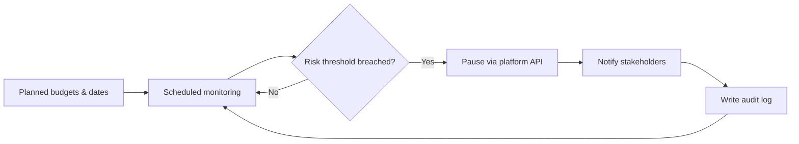
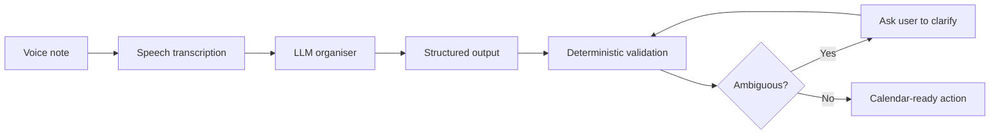

# AI Deployment Portfolio

### Savneet Singh Grewal
**Enterprise operator · AI solution builder · Deployment & adoption leader**

[LinkedIn](https://www.linkedin.com/in/savneet-singh-grewal/) · [Stand Relevant](https://standrelevant.com)

---

## What this portfolio is about

I work at the intersection of **business transformation, AI solution design, deployment, adoption and measurable operating outcomes**.

In my current role, I lead a **₹1,000 Cr annual biddable media business and an 85-person organization**, while also building AI-enabled operating systems that solve real execution and governance problems.

My focus is not AI demos. It is the harder question:

> **How do you turn AI and automation into a reliable system that people actually use in live operations?**

This repository documents three examples.

| Deployment | Problem solved | Outcome |
|---|---|---|
| **OAMS** | Prevent media overspends at enterprise scale | ₹314 Cr governed; zero reported overspends after deployment |
| **KOLO** | Scale creator/KOL execution without delays or manual errors | 75% lower execution effort; helped secure ₹36 Cr annual managed media mandate |
| **AI Brain Dump** | Convert unstructured voice into safe, structured actions | Deployed LLM prototype with ambiguity controls and Calendar integration |

---

# 01 · OAMS — Overspend Alert Management System

## Business problem

At large media scale, manual checks can identify overspend only after the damage has occurred.

The objective was to create a **preventive control system** that could continuously monitor live campaign conditions, identify risk early, intervene safely and leave an auditable trail.

## Architecture

## Deployment scale

- **₹314 Cr** of media spend governed
- **54 clients**
- **159 ad accounts**
- ~**2,000 campaigns**
- ~**4,500 ad sets**
- **Zero reported overspends after deployment**

## Key technical / product decision

The most important decision was **where not to use an LLM**.

Because OAMS could pause live media spend, the control layer remained deterministic:

- explicit thresholds
- predefined business rules
- auditable actions
- structured exception handling
- human oversight

AI accelerated development, diagnostics and workflow design, but **high-consequence financial actions remained governed by deterministic controls**.

### What this demonstrates

`Enterprise risk` · `API integration` · `automation` · `controls` · `human-in-the-loop design` · `production deployment` · `change management`

---

# 02 · KOLO — KOL Orchestrator

## Business problem

Creator/KOL activations involved repetitive manual execution across platforms, spreadsheets, approvals and quality checks.

At enterprise volume, that created three problems:

1. **Execution delays**
2. **Manual errors**
3. **Limited scalability**

I identified the opportunity to turn that operating constraint into a **technology-led commercial differentiator**.

## Architecture

## Results

- Execution effort reduced from **~800 to ~200 man-hours/month**
- **75% reduction** in execution effort
- **Zero execution errors** in live operations
- **Zero delays** in live operations

## Commercial impact

KOLO became a key differentiator during a competitive digital media review for **Reckitt Benckiser (RB)**, where the mandate was expected to move to another agency.

Rather than presenting only a conventional media strategy, I translated the execution problem into a business case around **speed, scalability, governance and risk reduction**.

The solution helped influence the client's decision to award us a **₹36 Cr (~US$4M) annual managed media mandate**.

## My role across the lifecycle

I remained involved after the win: testing the product end to end, supporting rollout, hand-holding the operating team during scaled execution, resolving issues and staying engaged until adoption stabilized.

### What this demonstrates

`Presales` · `solution design` · `commercial value creation` · `workflow automation` · `deployment` · `postsales adoption` · `operating scale`

---

# 03 · AI Brain Dump — Voice → Structured Action

## Business problem

People often capture work as unstructured voice notes:

> “Call Dad tomorrow at 5, order diapers tonight, pay the electricity bill by Friday, and sometime next week get the plumber.”

The difficult problem is not transcription. It is converting probabilistic natural-language interpretation into **safe deterministic actions**.

## Architecture

## What I built

A deployed prototype that turns an unstructured voice note into structured tasks, reminders and calendar-ready actions.

Core capabilities include:

- speech-to-text transcription
- LLM-based task extraction and structuring
- relative-date interpretation
- Roman-Hinglish / multilingual normalization
- Google OAuth
- Google Calendar integration
- duplicate protection
- retries and state management
- ambiguity detection
- human clarification before unsafe execution

## Key architecture principle

> **Use the LLM for interpretation. Use deterministic application logic for execution.**

Examples:

- `tomorrow at 5 PM` → resolve deterministically
- `Friday tak` → map using explicit date rules
- `sometime next week` → do **not** silently create an event; ask the user to clarify

When confidence is insufficient, the system routes the decision back to the user.

## Technical stack

`LLMs` · `speech transcription` · `structured outputs` · `Next.js` · `APIs` · `Google OAuth` · `Google Calendar API` · `Google Cloud Run` · `GitHub` · `testing & debugging`

### What this demonstrates

`LLM orchestration` · `structured outputs` · `API integration` · `cloud deployment` · `failure handling` · `human-in-the-loop AI`

---

# How I approach enterprise AI deployment

## 1. Start with the business constraint

Do not begin with:

> “Where can we use AI?”

Begin with:

> **“Where are we losing time, money, control or scalability?”**

---

## 2. Separate probabilistic intelligence from deterministic control

LLMs are strong at interpretation, summarisation, classification, reasoning over unstructured inputs and generating candidate actions.

They should not automatically own every high-risk decision.

For financial, operational or customer-impacting actions, I prefer:

- explicit business rules
- validation layers
- thresholds
- audit trails
- human escalation

---

## 3. Design for deployment, not just the demo

A useful prototype answers:

> “Can this work?”

A deployable enterprise system also has to answer:

- What happens when an API fails?
- What happens when the model is uncertain?
- How do we prevent duplicate actions?
- Who can override the system?
- What gets logged?
- How does it fit existing workflows?
- How do users trust it?
- How do we measure business value?

---

## 4. Treat adoption as part of the architecture

A technically correct system that users avoid is not a successful deployment.

My deployment lifecycle therefore includes:

**testing → rollout → user training → operating support → feedback → iteration → scaled adoption**

---

# AI & technical fluency

### AI

LLM workflows · prompt engineering · structured outputs · agentic workflow concepts · human-in-the-loop AI · AI-assisted prototyping · evaluation and failure-mode thinking

### Engineering / deployment

APIs · Google Apps Script · Python · Next.js · GitHub · Google Cloud · Cloud Run · OAuth · testing & debugging

### Enterprise deployment

Problem diagnosis · use-case design · ROI / business-case development · presales solution shaping · deployment planning · change management · executive stakeholder engagement · operating governance

---

# Why the production repositories are private

The systems described here were built around real enterprise workflows and may contain client-specific operating logic, platform configurations, internal data structures, environment configuration and commercially sensitive implementation details.

For that reason, the production repositories remain **private by design**.

This public portfolio documents the **business problem, architecture, deployment approach, technical trade-offs and measurable outcomes** without exposing confidential source code or client data.

I am happy to discuss architecture, design decisions, testing methodology, failure modes and implementation details in a technical interview.

---

# Current focus

I am most interested in roles where I can bridge:

**C-suite business problem**  
↓  
**AI strategy & solution architecture**  
↓  
**hands-on prototyping**  
↓  
**enterprise deployment**  
↓  
**adoption & measurable outcomes**

---

## Contact

**Savneet Singh Grewal**

[LinkedIn](https://www.linkedin.com/in/savneet-singh-grewal/) · [Stand Relevant](https://standrelevant.com) · GitHub: [`aisavvy90`](https://github.com/aisavvy90)
