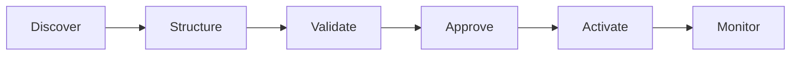

# AI-Assisted Activation Workflow

> From fragmented execution to governed orchestration.

[← Portfolio home](../README.md)

## The operating problem

A high-volume activation process depended on repetitive handoffs, disconnected trackers and manual quality checks. The constraint was not a lack of effort; it was an operating model that could not scale cleanly without additional delay and risk.

## The system pattern

The redesigned workflow introduced:

- structured inputs and business rules;
- validation before execution;
- approval gates and human accountability;
- controlled activation;
- execution visibility and monitoring;
- a feedback loop for post-launch improvement.

## Public outcome

- **75% lower execution effort**
- **Zero reported execution errors** during the monitored rollout
- **Zero reported execution delays** during the monitored rollout

Client identity, internal product name, mandate value and proprietary implementation details are intentionally excluded.

## My contribution

I led problem discovery, workflow design, solution shaping, AI-assisted development, end-to-end testing, deployment support, team enablement and post-launch iteration.

## What this demonstrates

`Solution design` · `AI-assisted product building` · `workflow orchestration` · `governance` · `deployment` · `adoption` · `operating improvement`

