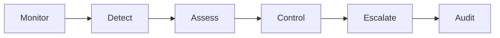

# AI-Assisted Risk Control System

> From retrospective recovery to governed preventive action.

[← Portfolio home](../README.md)

## The operating problem

Manual monitoring at enterprise media scale can surface risk only after it has become an incident. The opportunity was to redesign the control model around early detection, preventive action and clear accountability.

## The system pattern

The workflow combines:

- scheduled monitoring of live operating conditions;
- explicit thresholds and business rules;
- governed preventive controls;
- stakeholder notifications and exception routing;
- structured logs for review and auditability;
- human oversight for high-consequence decisions.

## Public outcome

**Zero reported overspend incidents across the controlled scope after deployment.**

The result is presented at a deliberately aggregated level. Client names, internal system identifiers, commercial scope and production configuration are excluded.

## The critical AI decision

The most important choice was where **not** to use an LLM. AI accelerated analysis, workflow design, development and diagnostics, but live control actions were bounded by deterministic rules, explicit permissions and auditable execution.

## My contribution

I led problem diagnosis, business-rule design, workflow architecture, AI-assisted development, testing, deployment planning, SOP creation, user enablement and production monitoring.

## What this demonstrates

`Enterprise risk` · `AI-assisted building` · `API integration` · `governed automation` · `human oversight` · `production deployment` · `change management`
