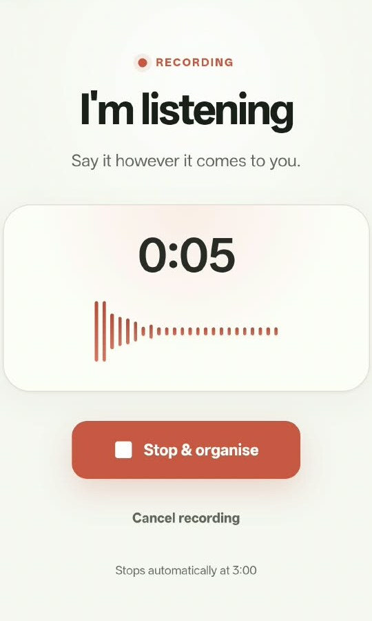
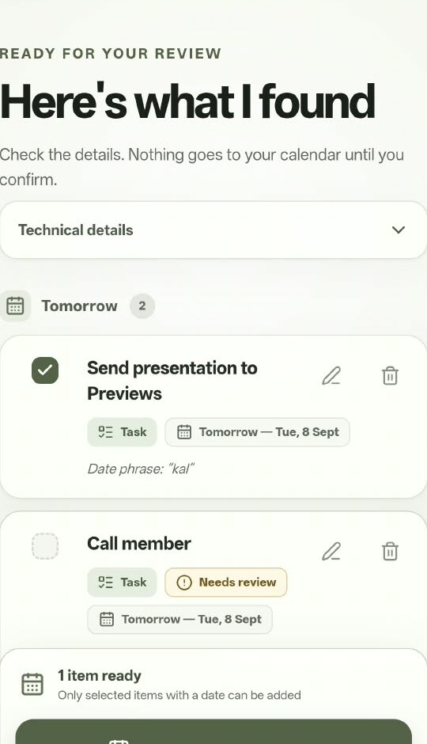
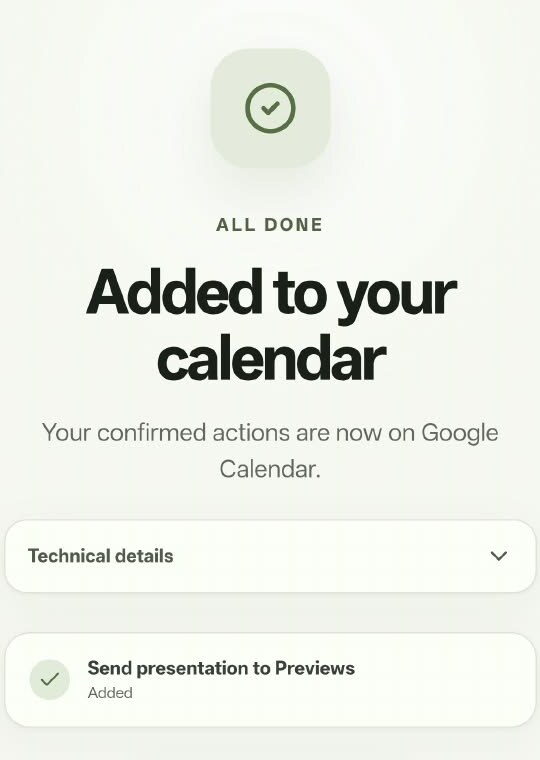
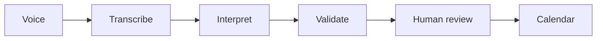

# SpokenNext

> Speak naturally. Review the intent. Move the right actions forward.

[← Portfolio home](../README.md) · [Try the live prototype](https://ai-brain-dump-794462594625.asia-south1.run.app/?final-android=1)

## The product idea

Work rarely arrives as clean form fields. It arrives as a half-formed thought:

> “Send the presentation tomorrow, call the member, and make notes after I return.”

Transcription is only the first step. The harder product problem is converting natural speech into structured actions without silently inventing missing details or executing the wrong thing.

## The experience

<table>
  <tr>
    <td align="center"> <strong>1 · Capture</strong></td>
    <td align="center"> <strong>2 · Review</strong></td>
    <td align="center"> <strong>3 · Execute</strong></td>
  </tr>
</table>

## What the prototype does

- records a short English or Hinglish voice note;
- transcribes the recording;
- extracts tasks and date intent into structured output;
- separates ready actions from ambiguous ones;
- lets the user edit, remove or date an item;
- requires confirmation before writing to Google Calendar;
- avoids storing audio or transcripts in the application database.

## Architecture principle

> **Use AI for interpretation. Use deterministic application logic and human confirmation for execution.**

Clear dates can be resolved. Ambiguous instructions are held for review. No calendar action is created until the user confirms it.

## Build and deployment

`LLM workflow` · `speech transcription` · `structured outputs` · `Next.js` · `Google OAuth` · `Google Calendar API` · `Google Cloud Run` · `mobile testing` · `failure handling`

The source repository has not yet been published. This case study documents the product behaviour and design choices without presenting private credentials or implementation secrets.

## My contribution

I shaped the use case, interaction model, ambiguity rules, privacy behaviour, AI-assisted build, testing and cloud deployment.

