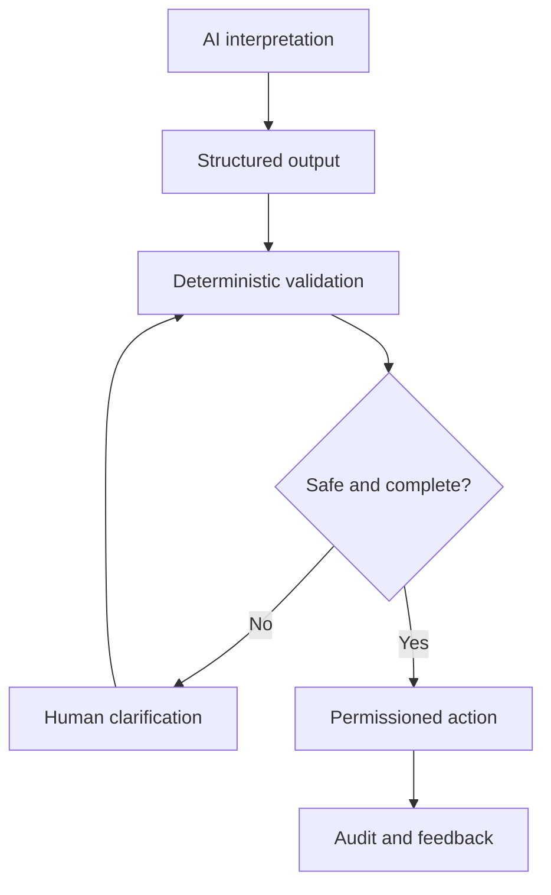

# Responsible Deployment and Adoption

[← Portfolio home](../README.md)

## Production questions beyond the demo

A prototype asks: **Can this work?**

A production workflow must also answer:

- What happens when the model is uncertain?
- What happens when an external API fails?
- Which actions require human confirmation?
- How are duplicates prevented?
- What is logged, and who can inspect it?
- How can a user override or reverse an action?
- What data is stored—and what should never be stored?
- How is value measured after rollout?

## Preferred control pattern

## Adoption loop

**Pilot → train → observe → support → learn → improve → scale**

The goal is not maximum automation. It is the right balance of intelligence, control, usability and accountability for the operating context.

